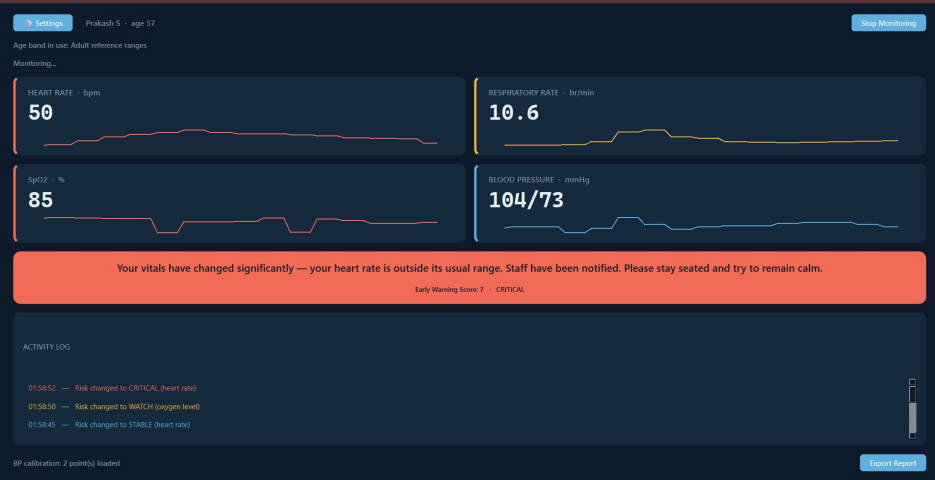
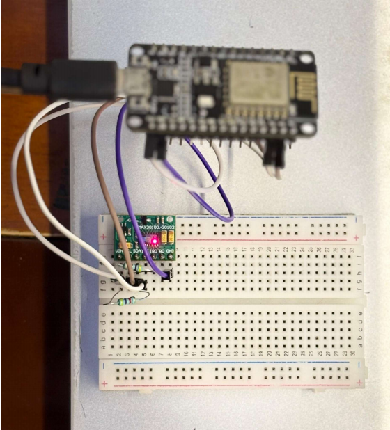

# OmniPulse: AI-Assisted Patient Monitoring System

OmniPulse is an end-to-end monitoring system that extracts four vital signs from a single continuous photoplethysmography (PPG) waveform. It acts as an active triage support tool by fusing raw data into a clinical Early Warning Score (EWS).

### Key Features
* **Single-Sensor Extraction:** Derives Heart Rate (HR), Blood Oxygen (SpO2), Respiratory Rate (RR), and cuffless Blood Pressure (BP) strictly from one MAX30102 sensor.
* **Cuffless Blood Pressure:** Uses morphological feature analysis (crest-time ratio) and per-patient baseline calibration to track BP changes without a physical cuff.
* **Respiratory Rate:** Extracts breathing rate from the PPG waveform using autocorrelation on Respiratory-Induced Intensity Variation (RIIV), effectively filtering out non-respiratory frequencies.
* **Outpatient Early Warning Score (EWS):** Maps vitals to actionable risk levels (Stable, Watch, Critical) using custom, wider-range thresholds calibrated for daily home monitoring rather than hospital-ward standards. This significantly reduces false alarms for healthy resting baselines.
* **Smart UI:** Multi-threaded PySide6 interface featuring live trend sparklines, visual risk accents, and plain-language patient guidance.

### Built With
* **Hardware Setup:** ESP8266 NodeMCU, MAX30102 PPG Sensor
* **Backend Processing:** Python (NumPy, SciPy)
* **Frontend Dashboard:** PySide6 (Qt)

### System Architecture & Hardware

**Architecture Flow:**

**Hardware Prototype:**

